# Emilia

**Adaptive music, podcast, streaming and audio-drama player for the Linux desktop and Phosh
smartphones** (Librem 5, PinePhone & co.) – one adaptive interface for both. Written in **Rust**

⚠️ **AI-assisted project**  

> App ID: `de.cais.Emilia` · License: GPL-3.0-or-later

---

## Screenshots

<table>
  <tr>
    <td align="center">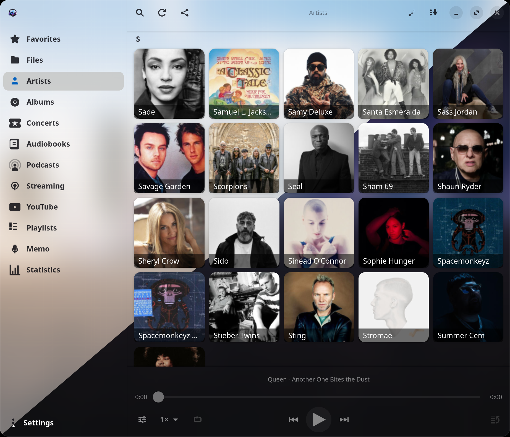<br><em>Library by artist — light &amp; dark theme</em></td>
    <td align="center">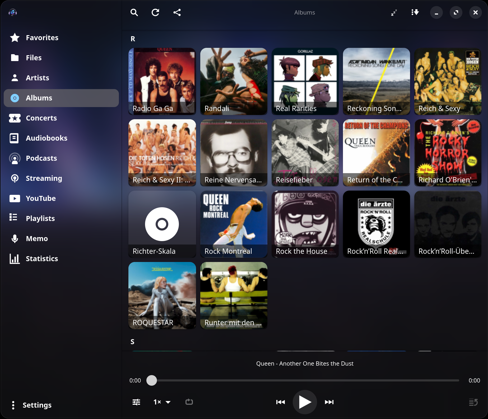<br><em>All albums with covers</em></td>
  </tr>
  <tr>
    <td align="center">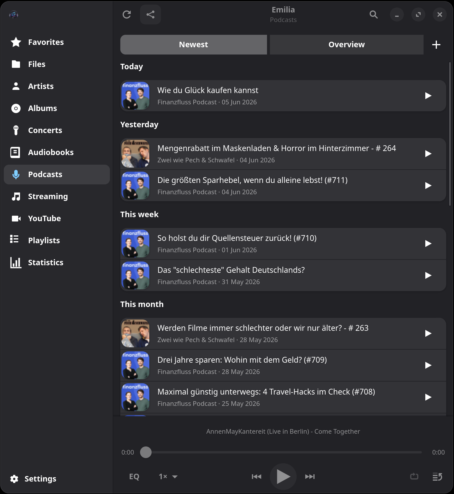<br><em>Podcasts</em></td>
    <td align="center">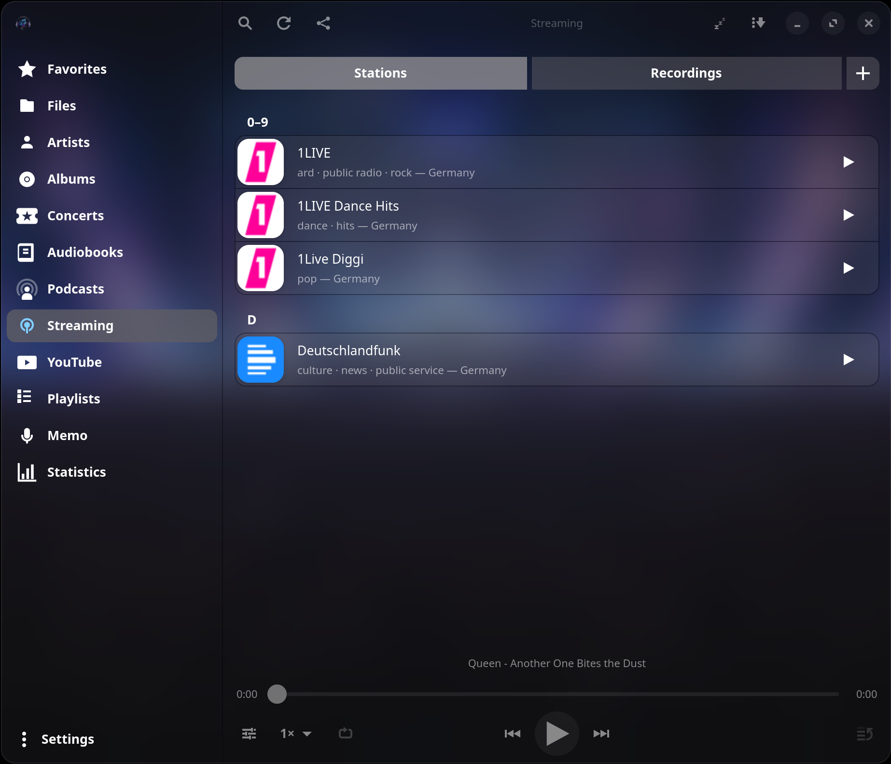<br><em>Internet radio &amp; recordings</em></td>
  </tr>
  <tr>
    <td align="center">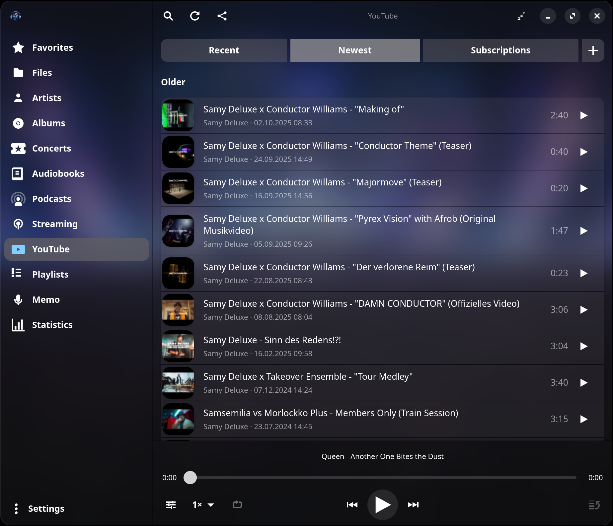<br><em>YouTube as a music source</em></td>
    <td align="center">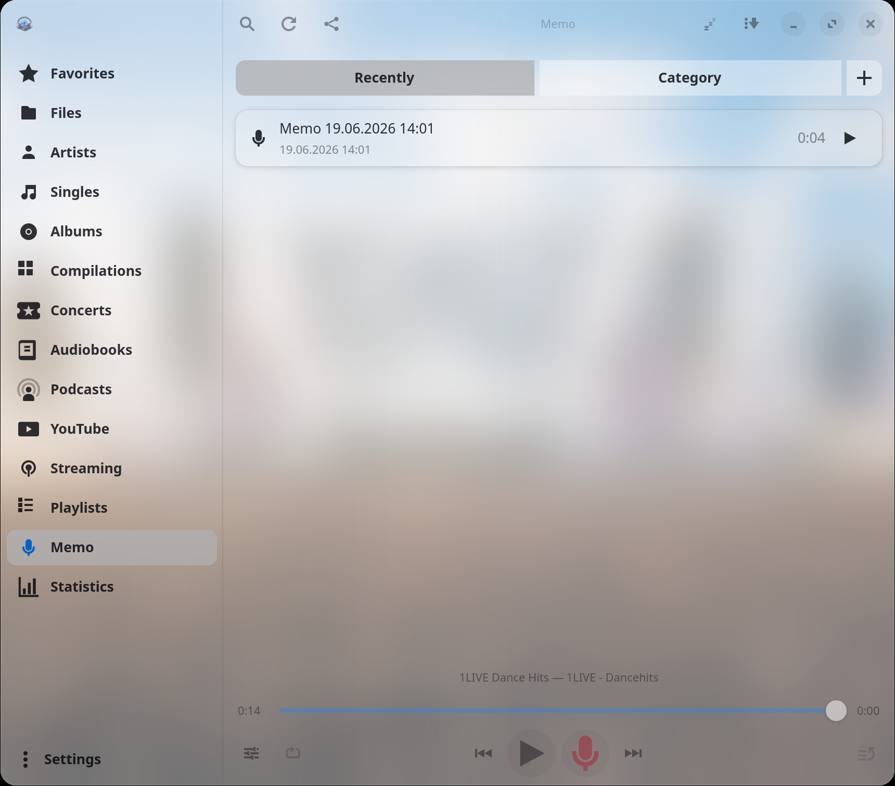<br><em>Voice memos</em></td>
  </tr>
  <tr>
    <td align="center">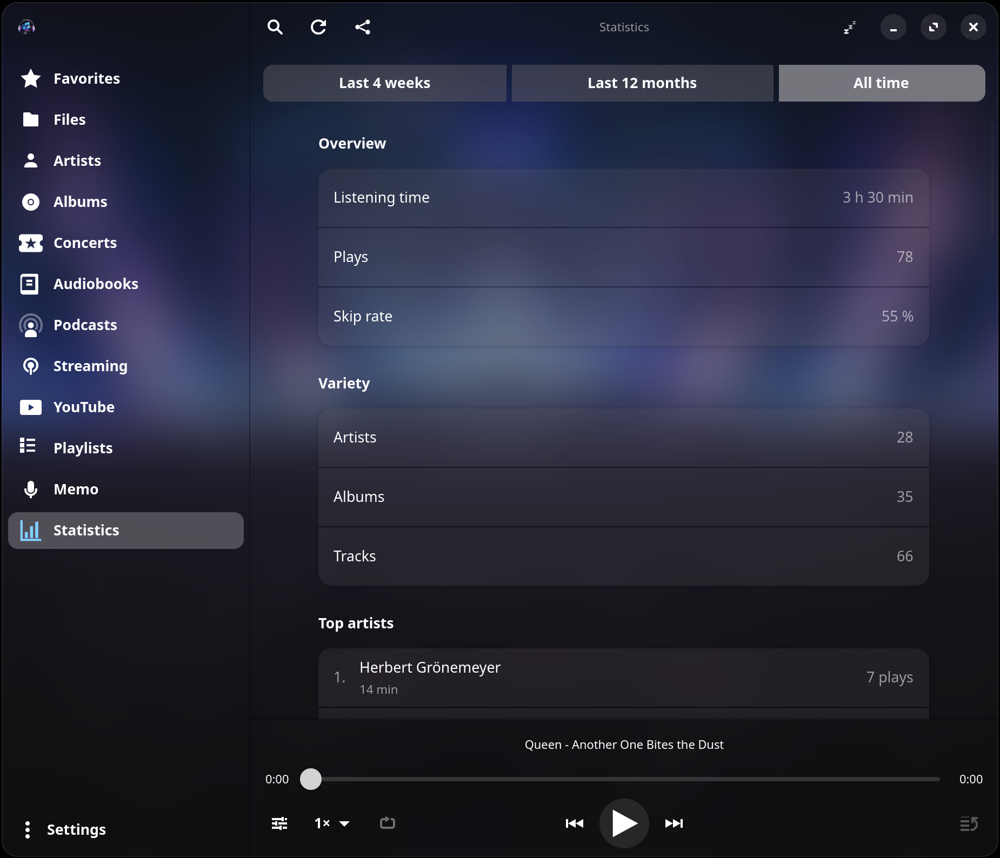<br><em>Listening statistics</em></td>
    <td align="center">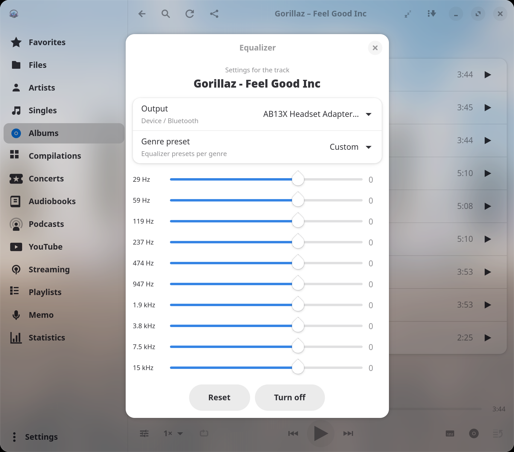<br><em>10-band equalizer with cascade</em></td>
  </tr>
  <tr>
    <td align="center">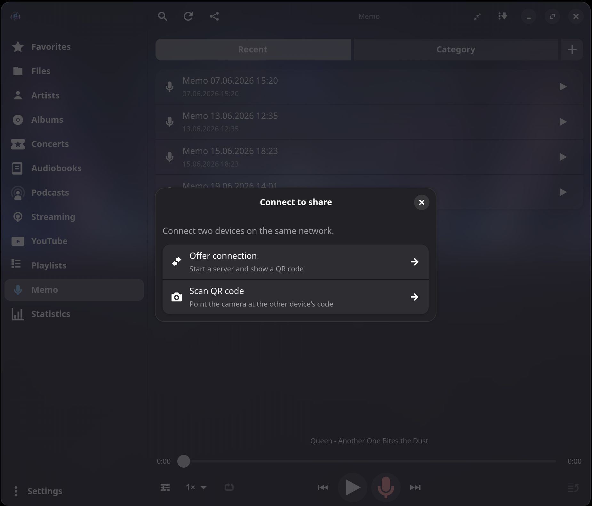<br><em>Share between devices over the LAN</em></td>
    <td align="center">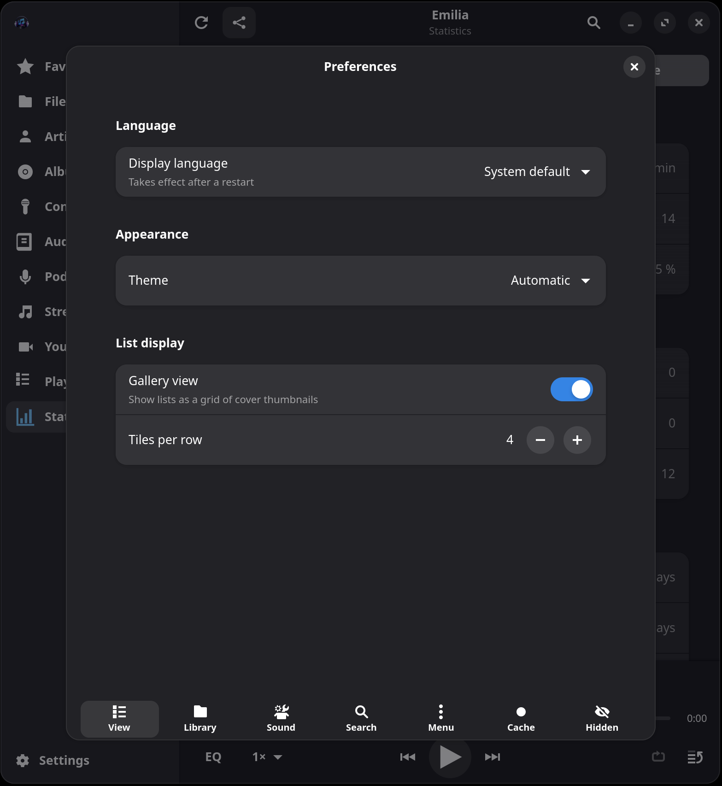<br><em>Preferences</em></td>
  </tr>
</table>

<p align="center">
  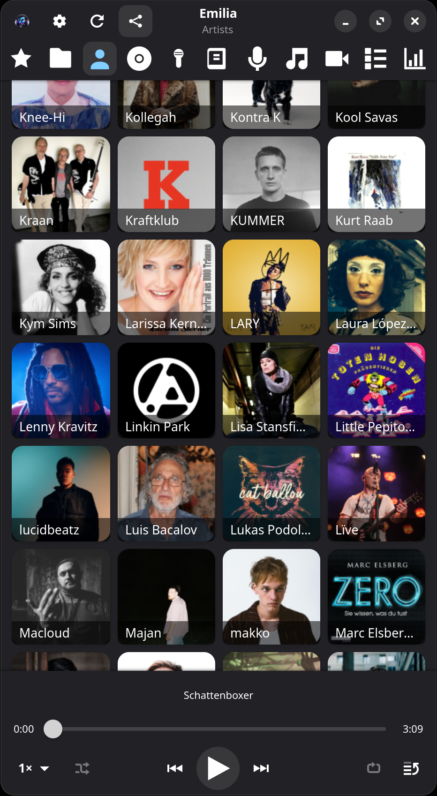<br>
  <em>Adaptive phone layout (portrait)</em>
</p>

---

## What Emilia can do

- **Adaptive interface** – works in narrow portrait (phone) and on the desktop;
  the navigation collapses automatically on mobile.
- **Scan a music folder** – recursive background scan, tags & covers via
  `lofty`. Audio files are only ever **read**, never modified.
- **Several views** of the library:
  - **File system** – reliable navigation even with patchy tags (important for
    audio dramas). Additional music sources (a second local folder or a
    Nextcloud/WebDAV remote) appear here as their own **tabs**.
  - **Artists** – a single tap opens a subpage with the artist's **albums** (with
    covers) and, below them, the **single tracks** (guest/feature tracks and
    tracks without an album). An album opens its track list.
  - **Albums** – all albums with covers.
  - **Concerts** – mark and collect live/unplugged recordings; an import suggests
    likely candidates.
  - **Favorites**, **Audiobooks**, **Statistics**.
- **Cover & photo galleries** – open an album's or artist's detail view to pick
  among several cover/photo candidates (swipe the carousel or **tap the dots** to
  jump straight to one), or upload your own image. Choosing an artist photo never
  changes the album covers.
- **Playback** – play/pause, next/previous, shuffle, a whole-queue **repeat**
  toggle (at the end of the queue it starts over), a queue, and a bottom
  mini-player with a **seek bar** (scrub through long tracks).
- **Gapless & crossfade** – seamless transitions for sequential local queues
  (albums, concerts, audiobooks); an optional, configurable **crossfade** overlaps
  the end of one track with the start of the next. Streams, podcasts, YouTube,
  Nextcloud and shuffle keep the normal end-of-track path.
- **Sleep timer** – the header "zzz" button starts a countdown from a preset; the
  volume gently **fades out** over the final two minutes before playback stops.
- **Quick filter** – a funnel button reveals an inline search bar that filters the
  list you're looking at (Files / Artists / Albums) live, separate from the global
  search dialog.
- **Lock screen & media keys** – control via **MPRIS** (play/pause, next/previous,
  seek) including title/album display.
- **Playlists** – create your own playlists, add tracks/albums/folders via the
  options, play, rename and remove individual tracks.
- **Lyrics & karaoke** – lyrics are read from the file's tags, then the local
  cache, then looked up online at **LRCLIB**. A pulldown on the file-info page
  shows them; for time-synced lyrics a **karaoke view** highlights and scrolls the
  active line. Fetched lyrics are only cached in the database, never written back
  into the audio files.
- **Podcasts** – subscribe to feeds by RSS address or search the iTunes directory;
  episodes are **streamed** directly, with show notes, chapter marks
  and resume. 
- **Streaming / Internet radio** – add a stream URL or **search stations
  worldwide** (Radio-Browser API). Live now-playing title from the ICY metadata,
  plus a **timeshift recorder**:
  - a rolling ring buffer (configurable up to 60 minutes) lets you **record a song
    even after it has played** – press record at the end of a song and the whole
    song is saved;
  - automatic split at song boundaries, online cover/metadata embedded into the
    saved file;
  - saved songs live in a dedicated **Recordings** section. From there you can
    **edit** a recording in a built-in **waveform editor** – mark a region, cut it
    out with the scissors, zoom (+/− or scroll) and pan, scrub a timeline and play
    from the playhead (*Save re-encodes and overwrites the file*) – or **add a
    recording to your music library** as a regular track.
- **Voice memos** – record from the microphone with the player-bar record button;
  memos collect in their own **Memo** section with **Recent** and **Category** tabs
  (organise them into freely named categories). A memo can be trimmed in the same
  waveform editor as a recording (saved as Ogg/Opus).
- **YouTube** – search for tracks and play them in-app, or **add a track to your
  library**. The section can be hidden in the navigation if you don't need it.
- **Nextcloud** – connect a Nextcloud (login QR code or manual), then **index its
  music into the library** so the tracks behave 1:1 like local songs (Artists,
  Albums, queue, resume). Audio streams on demand; duration,
  covers and photos are cached locally for performance.
- **Device sync** – share library/resume data between devices over the LAN with a
  QR-code pairing handshake.
- **Equalizer with cascade** – 10-band EQ (`equalizer-10bands`), live during
  playback. Settings apply in the order **Global → Artist → Album → Track** (the
  most specific level wins), additionally per **output device/headphones**
  (PipeWire sink).
- **Fetch online metadata** (optional) – from open sources:
  - album covers via **MusicBrainz** + **Cover Art Archive**
  - artist photos via **Deezer** (no key required)
  - track recognition via **AcoustID/Chromaprint** (needs `fpcalc` + a free
    AcoustID key) for files with patchy tags
  - extra image galleries via **fanart.tv** (optional key)

  Everything is stored only in the local database and the XDG cache – never in the
  audio files.

---

## Installation

### Flatpak (recommended)

Pre-built, **GPG-signed** bundle for **x86_64 and aarch64** – ideal for the phone,
no build tools needed. From the project repo (GitHub Pages):

```bash
flatpak remote-add --if-not-exists emilia https://misc-de.github.io/emilia/de.cais.Emilia.flatpakrepo
flatpak install emilia de.cais.Emilia
flatpak run de.cais.Emilia
```

Update later with `flatpak update de.cais.Emilia`. The signing key is already
embedded in the `.flatpakrepo` file – nothing needs to be imported separately.

> Prefer to compile it yourself? See
> [Building from source &amp; project layout](BUILDING.md).

---

## Getting started

1. Start Emilia and open **Settings** (the gear) at the top.
2. Pick the **music folder** – Emilia scans the library in the background.
3. Browse and play via **Artists** / **Albums** / **File system**.
4. Optional: under **Search**, enable "Fetch automatically" to fill in covers,
   artist photos and (with `fpcalc` + an AcoustID key) missing tracks.
5. Equalizer: long-press a track/album/artist → **Equalizer**, or the global EQ in
   the settings.

### Streaming & recordings

- Open the **Streaming** section, tap **+** to add a stream URL or search for a
  station worldwide.
- Tap a station to play; the player bar shows a red **record** button next to
  play/pause. Set the recording buffer under **Settings → Cache & recordings**
  (0 turns it off). Recorded songs appear under **Recordings**.
- Long-press a recording for its detail page: **Play**, **Add to library**,
  **Edit** (open the waveform editor to trim it) or delete it.

### Nextcloud

- **Settings → Library → Connect to Nextcloud**: scan the login QR code (the
  camera starts immediately) or expand the manual entry, then set the music
  folder. On connect the cloud library is indexed in the background and shows up
  under Artists/Albums.

### Online metadata (optional)

- An **AcoustID key** (free, for fingerprint track recognition) and a
  **fanart.tv key** (for extra images) can be stored under **Settings → Search**.
  Without keys those phases are simply skipped.
- Covers (MusicBrainz/Cover Art Archive) and artist photos (Deezer) work without a
  key.

---

## Where data is stored

| Content                  | Path                                        |
|--------------------------|---------------------------------------------|
| Library & settings       | `~/.local/share/emilia/library.db`          |
| Cover cache              | `~/.cache/emilia/covers/`                   |
| Artist photo cache       | `~/.cache/emilia/artists/`                  |
| Remote (Nextcloud) cache | `~/.local/share/emilia/cache/<source-id>/`  |

All settings (music folder, API keys, window state …) live in the SQLite database.

---

## Building from source &amp; contributing

Want to compile Emilia yourself or hack on it? The full build instructions
(dependencies for Arch, Debian/Ubuntu, Fedora), how to run, install and build
the Flatpak, plus the source-tree layout, live in a separate page:

➡️ **[Building from source &amp; project layout](BUILDING.md)**

For normal use you don't need any of that – the [Flatpak](#flatpak-recommended)
above is all you need.

---

## License

GPL-3.0-or-later. Online metadata comes from open sources (MusicBrainz/Cover Art
Archive: CC0; Deezer search API; AcoustID/Chromaprint; fanart.tv; Radio-Browser).
